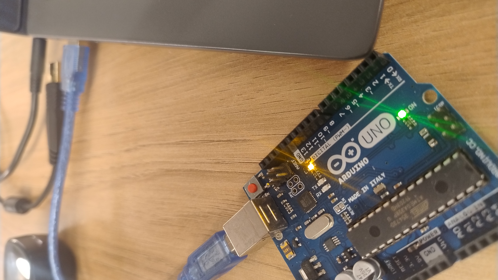

## Parte 1 - Blink Led Interno

código:
```C++
void setup() {
  // put your setup code here, to run once:
  pinMode(LED_BUILTIN, OUTPUT);
}

void loop() {
  // put your main code here, to run repeatedly:
  digitalWrite(LED_BUILTIN, HIGH);
  delay(2000);
  digitalWrite(LED_BUILTIN, LOW);
  delay(1000);
}
```

fotos:
<div align="center">
<br>
</div>


<a href="https://drive.google.com/file/d/1lGqBjxLY2vCItTCugzJK-xFPKeYF7zEo/view?usp=sharing">Link para vídeo de funcionamento do Blink Led Interno<a>