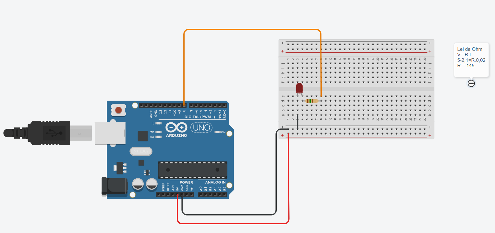

## Link para o Tinkercad


Print:
<div align="center">
<br>
</div>


código:
```C++
// Definindo a porta onde o led está ligado
int LED = 8;

// Void qual é rodado apenas ao ligar o Arduino
void setup(){
  pinMode(LED, OUTPUT); // Definindo a porta do LED como saída de energia
}
//Void qual sempre fica rodado enquanto o Arduino está ligado
void loop(){
  digitalWrite(LED, HIGH);// Liberando Energia para o LED
  delay(2000); // Delay de 2000 milisegundos
  digitalWrite(LED, LOW); // Desligando Energia do LED
  delay(2000); // Delay de 2000 milisegundos
}
```


<a href="https://www.tinkercad.com/things/efa9JpqIpc3-ponderadas1miguelclaret/editel?returnTo=https%3A%2F%2Fwww.tinkercad.com%2Fdashboard&sharecode=7cWIvTkrbTDNQIOH9tjl14kHg36lWLErT-VbSVIqzzs">Link aqui<a>