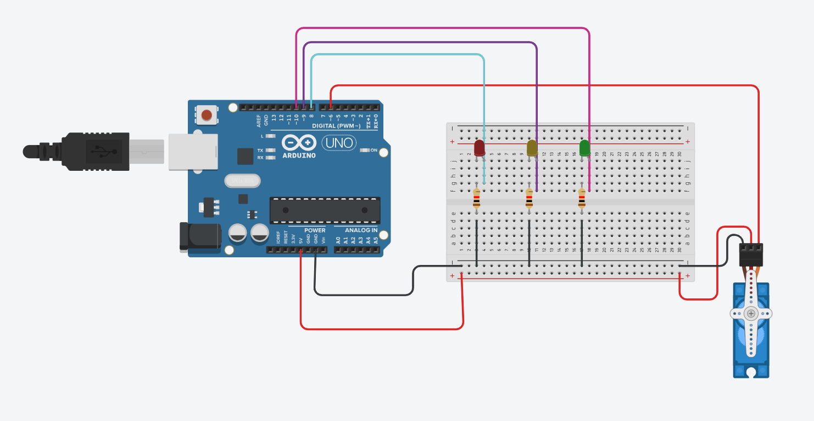
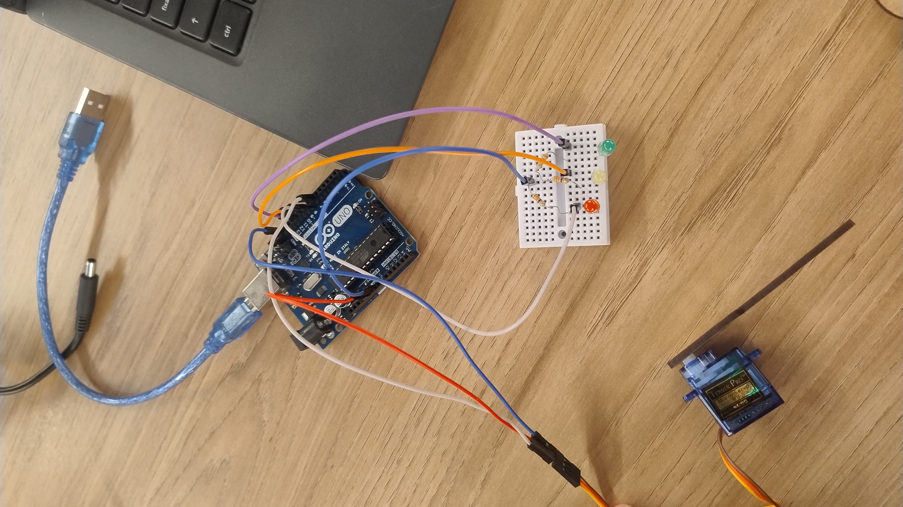

# Ponderada Semáforo semana 3

Essa foi a montagem do meu circuito 

Circuito:

 

Foto do Circuito Real:

 

Video do Circuito funcionando:
<a href="https://drive.google.com/file/d/1gsAVxR6WTB6O4PKmS887dqWqR4Jz_-iV/view?usp=sharing"> Link do video</a>  

Tabela componentes:
| Quantidade | Componente |
|----------|----------|
| 7 | Jumpers|
|3| Resistores de 330 ohms|
|1| Led Vermelho|
|2| Led Amarelo|
|3| Led Verde|
|1| Servo Motor|

### Avaliação que meu colega me deu:
#### Avaliador: Gabriel Santos do Nascimento
|Critério| Avaliação    |Observações do Avaliador|
|-|-|-|
|Montagem física com cores corretas, boa disposição dos fios e uso adequado de resistores   | 3 | |
|Temporização adequada conforme tempos medidos com auxílio de algum instrumento externo | 3 | |
|Código implementa corretamente as fases do semáforo e estrutura do código (variáveis representativas e comentários) | 3 | |
|Ir além: Implementou um componente de extra, fez com millis() ao invés do delay() e/ou usou ponteiros no código | 1 | Componente extra utilizado |
| |  |Pontuação Total: 10|

### Avaliação que eu dei ao meu colega:

#### Avaliador: Miguel da Silva Claret

|Critério| Avaliação	|Observações do Avaliador|
|-|-|-|
|Montagem física com cores corretas, boa disposição dos fios e uso adequado de resistores	| 3 | |	
|Temporização adequada conforme tempos medidos com auxílio de algum instrumento externo	| 3 | |	
|Código implementa corretamente as fases do semáforo e estrutura do código (variáveis representativas e comentários) | 3 | |	
|Ir além: Implementou um componente de extra, fez com millis() ao invés do delay() e/ou usou ponteiros no código | 1 | Utilizou a função `milis()` |	
| |  |Pontuação Total: 10|